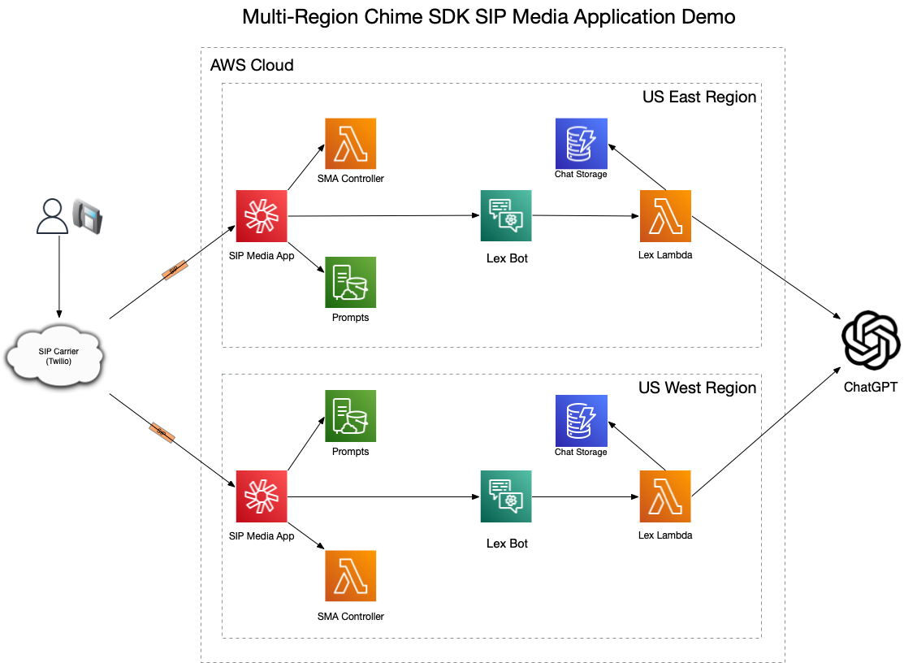
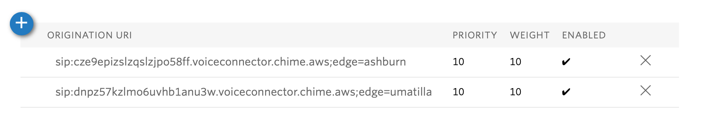
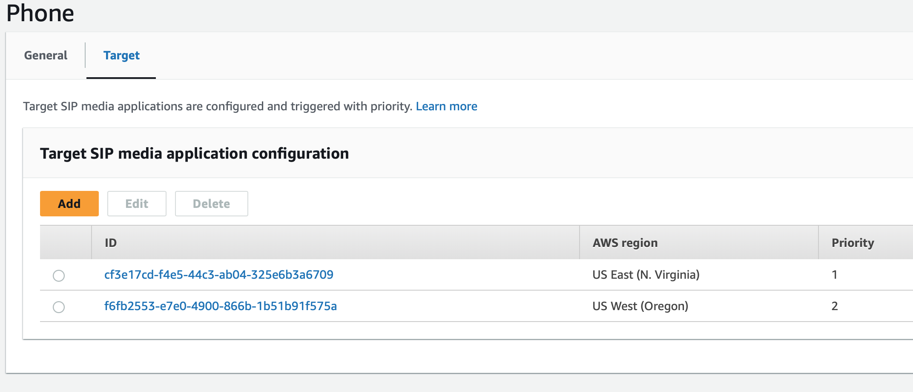

# Amazon Chime SDK SIP Media Application Java Library

## Background

This project provides a library to accelerate the development of [SIP Media Applications](https://docs.aws.amazon.com/chime-sdk/latest/ag/use-sip-apps.html) (SMA) in Java.
These apps allow for the deployment of multi-region and fault-tolerant self-service applications.  Some benefits of using Chime SDK versus 
[Amazon Connect](https://aws.amazon.com/pm/connect/) for self-service applications are:
- SIP Ingress
    - Bring your own carrier.
    - Load balance accross regions if desired.
- SIP Egress
    - Transfer calls to PBX's or other destinations via SIP for handling (PSTN bypass).
    - Use your preferred carrier to route calls or Amazon.
- Built from the ground up to be carrier class and multi-region.
- Amazon Chime PSTN numbers can span regions in the US (us-east-1 and us-west-2).
- Deployed as code versus Connect Flows.
    - Source control to manage and track changes.
    - Integrates into DevOps processes already in place.
- Central call control
    - Route calls to multiple Connect instances (many organizations have several instances and other groups on legacy systems).
    - Don't wrap/trombone calls through Connect instances when calls need to be transferred.
- Servicing calls in Chime SDK can potentially reduce costs.
    - SMA calls incur .002/min vs Connect .018/min for self-service.
    - PSTN Ingres and Egress charges are the same between Chime and Connect.

## Library Overview

The library provides two approaches, a JSON event mapping model, and on top of that a flow based library that lets programmers develop call flows 
without having to deal with event handling and flow optimization.  The latter allows developers to quickly build applications with minimal coding. 
See the Library [README](ChimeSMA/README.md) for more indepth information about using the library and writing applications.

### JSON Java Events

AWS Lambda is great at handling events in JSON.  AWS provides the [Lambda Java Events](https://github.com/aws/aws-lambda-java-libs/tree/main/aws-lambda-java-events) 
library to handle most of the services that directly integrate with Lambda and provides a full Java Object model for the requests and responses.  However the Chime SMA events are not included in this package.  This library is modeled after this approach and is used as follows:

- You define your Lambda to implement [RequestHandler](https://github.com/aws/aws-lambda-java-libs/blob/main/aws-lambda-java-core/src/main/java/com/amazonaws/services/lambda/runtime/RequestHandler.java)<[SMARequest](ChimeSMA/src/main/java/cloud/cleo/chimesma/model/SMARequest.java), [SMAResponse](ChimeSMA/src/main/java/cloud/cleo/chimesma/model/SMAResponse.java)> .
- Process the incoming request and repond as necessary, see [HellowWorld.java](Examples/src/main/java/cloud/cleo/chimesma/examples/response/HelloWorld.java) for an example.
- Note, you are responsible for handling the SMA state machine and this quickly becomes unamangeable as the complexity of what you are doing increases.
- Use this low-level approach when you need to control every aspect of the state machine.

### Java Action Flow Model

Building upon the above, the "Action Flow Model" maps each of the [supported actions for the PSTN Audio service](https://docs.aws.amazon.com/chime-sdk/latest/dg/specify-actions.html) 
to Java Objects that you dynamically connect to each other to create flows.  The Objects are easily extensible to allow the creation of complex interactions and routing. 
This part of the library provides:

- Flow based approach that makes developing applications easier to understand versus an event driven model.
    - The flow is built statically in memory at initializtion (SNAP Start Init) allowing for very low latency responses.
- Strong Java typing and builder approach for creating action objects.
- Sensible defaults are provided for most of the action parameters and can be set or passed into the Lambda (like BOT_ALIAS_ARN for example to start bot conversations) 
- Derived values whenever possible to reduce lines of code
    - Speak actions require you set SSML or Text for operations, the flow action takes just a text param and determines and sets the correct value when sending back the JSON.
- Response optimization sending multiple actions at once (SMA supports up to 10)
    - Each action is evaluated whether it can be chained with another before sending the action list.
    - Example: Pause -> Speak -> Pause -> StartRecording -> SpeakAndGetDigits sent one by one would require 4 Lambda calls without optimization.
    - Actions like SpeakAndGetDigits require a result before proceeding and cannot be chained with another action.
- Java Locale support across all relevant actions to easily build multi-lingual interactions (Prompts, Speak, and Bots)
- Extending existing actions is easy, see [CallAndBridgeActionTBTDiversion.java](Examples/src/main/java/cloud/cleo/chimesma/actions/CallAndBridgeActionTBTDiversion.java) which 
extends the standard [CallAndBridge](ChimeSMA/src/main/java/cloud/cleo/chimesma/actions/CallAndBridgeAction.java) action to write call info to a DyanmoDB table that can be used in a Connect flow to implement take back and transfer.  See use case later in this document.

To use the Flow Model:

- Simply create a Java Object that inherits from [AbstractFlow](ChimeSMA/src/main/java/cloud/cleo/chimesma/actions/AbstractFlow.java)
- Implement the getInitialAction() method that returns the start of the flow.
- See the flow based [HelloWorld.java](Examples/src/main/java/cloud/cleo/chimesma/examples/actions/HelloWorld.java) example.


## Amazon Connect Take Back and Transfer Use Case

This use case demonstrates sending calls to [Amazon Connect](https://aws.amazon.com/pm/connect/) and then later moving the call to some other destination 
like a PSTN number (which could be another Connect instance), SIP destination, or to continue a flow at the SMA Application.  Calls are released from
the Connect instance (call leg disconnected by the SMA Application) and moved to another destination.

The general steps are:
- [CallAndBridgeActionTBTDiversion](Examples/src/main/java/cloud/cleo/chimesma/actions/CallAndBridgeActionTBTDiversion.java) action writes call data to Dynamo DB table prior to actually moving the call.
- Connect Script executes a Lambda function to transfer calls


### High Level Components


### Connect Call Flow

In your connect flow, let's assume you have the destination number set on the contact attribute "TransferNumber".  Normally you would pass that
directly to "Transfer to phone number" step to place the outbound call.  For this use case, we simply insert a "Invoke AWS Lambda function" and "Wait"
step into the flow.  The orginal transfer step can be left in place as a failsafe. The wait condition gives the Lambda time to contact the Chime SDK API 
to signal the SMA app to disconnect the call.  Typically this all executes sub-second.


### Transfer Lambda

When invoking the Lambda from Connect, we pass both the Diversion header (Connect calls this "Call-Forwarding-Indicator") and the TransferNumber.


The lambda function then:
- Extracts the key from the SIP header (a random E164 number).
- Executes a Dynamo DB call to retrieve the call information which consists of: 
    - AWS Region
    - sipMediaApplicationId
    - transactionId
- Finally, executes a Chime SDK API call to UpdateSipMediaApplicationCall:
    - The region is used to initialize the client SDK properly to support calls ingressing from either region.
    - The TransferNumber is passed as a parameter so the SMA Handler knows where to transfer the call to.

Sample Lambda code in NodeJS.
  ```javascript
        const {ChimeClient, UpdateSipMediaApplicationCallCommand} = require("@aws-sdk/client-chime");
        const {DynamoDBClient, GetItemCommand} = require("@aws-sdk/client-dynamodb")
        const ddb = new DynamoDBClient();
        const regex = /(\+[0-9]+)/;
        const table_name = process.env.CALLS_TABLE_NAME;
        exports.handler = async function (event) {
            console.log(JSON.stringify(event));
            let match = event.Details.Parameters.Diversion.match(regex);
            console.log('Extracted phone is ' + match[1] );
            
            const dparams = {
                Key : {
                  phoneNumber : {
                    S: match[1]
                  }
                },
                TableName: table_name
            };
            
            const dresponse = await ddb.send(new GetItemCommand(dparams));
            console.log(JSON.stringify(dresponse))
            
            const cparams = {
                SipMediaApplicationId: dresponse.Item.sipMediaApplicationId.S,
                TransactionId: dresponse.Item.transactionId.S,
                Arguments: {
                    phoneNumber: event.Details.Parameters.TransferNumberD
                }   
            };
            // We need to know region before initializing client
            const chime = new ChimeClient({ region: dresponse.Item.region.S,  });
            const cresponse = await chime.send(new UpdateSipMediaApplicationCallCommand(cparams));
            console.log(JSON.stringify(cresponse));
            return {status: 'OK'};
        };
  ```

## Example Flow Application

The [Example Flow](Examples/src/main/java/cloud/cleo/chimesma/examples/actions/ExampleFlow.java) excercises a number of the 
Actions provided by the Chime SDK.  The Connect use case above is also incoporated into the Demo app.

### High Level Components



### Calling into the Demo Application

#### Twilio

[Twilio SIP Trunking](https://www.twilio.com/docs/sip-trunking) can be used to send calls into your SMA's or the SIP carrier of your choice.  
For this demo, the Twilio number of +1-320-495-2425 will be load balanced across regions.  The first prompt in the demo announces the region
so you can observe that calling the above number will land you in either us-east-1 or us-west-2.  When configuring the Twilio 
[Origination Settings](https://www.twilio.com/docs/sip-trunking#origination) you can make use of the "edge" setting to optimize the SIP traffic.  

In this case, the first SIP URI references a [Voice Connector](https://docs.aws.amazon.com/chime-sdk/latest/ag/voice-connectors.html) in the us-east-1 
region, so by adding the "edge=asburn" twilio will egress that call into AWS all within us-east-1.  The same applies for the "edge=umatilla" which is 
Twilio's edge in Oregon (us-west-2).  You don't want your traffic traversing all over the internet if that can be avoided.



#### Chime SDK Phone Number

After provisiong a [phone number in Chime](https://docs.aws.amazon.com/chime-sdk/latest/ag/provision-phone.html) ,
you create a [SIP Rule](https://docs.aws.amazon.com/chime-sdk/latest/ag/understand-sip-data-models.html) for the phone number.  Chime does not allow 
load balancing, so you must setup an ordered priority.  When you call +1-320-200-2007 you will always be routed the SMA in us-east-1, and only if 
that region or the Lambda associated with the SMA goes down, then you will fail over to us-west-2.



#### Asterisk PBX

For testing apps there certainly is no reason to incur PSTN charges, so I use an IP Phone connected to [Asterisk](https://www.asterisk.org) to place 
calls into SMA's.  Like Twilio above, in the [pjsip_wizzard.conf](https://wiki.asterisk.org/wiki/display/AST/PJSIP+Configuration+Wizard) you can create trunks 
for each region endpoint:

```
[aws-chime-east]
type=wizard
transport=transport-udp
remote_hosts=cze9epizslzqslzjpo58ff.voiceconnector.chime.aws
endpoint/disallow=all
endpoint/allow=ulaw
endpoint/direct_media=no
endpoint/dtmf_mode=auto
endpoint/rtp_symmetric=yes

[aws-chime-oregon]
type=wizard
transport=transport-udp
remote_hosts=dnpz57kzlmo6uvhb1anu3w.voiceconnector.chime.aws
endpoint/disallow=all
endpoint/allow=ulaw
endpoint/direct_media=no
endpoint/dtmf_mode=auto
endpoint/rtp_symmetric=yes
```

You can observe no less than 12 endpoints are ready to take your call in each region !!!

```
Asterisk*CLI> pjsip show endpoint aws-chime-oregon 

Endpoint:  aws-chime-oregon                                     Not in use    0 of inf
        Aor:  aws-chime-oregon                                   0
      Contact:  aws-chime-oregon/sip:dnpz57kzlmo6uvhb1anu3 228c75f425 Created       0.000
  Transport:  transport-udp             udp      0      0  0.0.0.0:5060
   Identify:  aws-chime-oregon-identify/aws-chime-oregon
        Match: 99.77.253.106/32
        Match: 99.77.253.110/32
        Match: 99.77.253.109/32
        Match: 99.77.253.104/32
        Match: 99.77.253.102/32
        Match: 99.77.253.107/32
        Match: 99.77.253.103/32
        Match: 99.77.253.105/32
        Match: 99.77.253.11/32
        Match: 99.77.253.0/32
        Match: 99.77.253.108/32
        Match: 99.77.253.100/32
```

In the [extensions.conf](https://wiki.asterisk.org/wiki/display/AST/Contexts%2C+Extensions%2C+and+Priorities) you configure a number you can dial 
to route to the trunks in question.  The number  +1-703-555-0122 is a Chime Call in number than can be used to route to SMA's.  This allows you to 
call into connectors and your SMA with a sip rule without provisioning a phone number at all !

- 290 will try us-east-1 first and if it fails, you hear a prompt (so you know the first region was down) and then it tries the next region
- 291 will call only us-east-1
- 292 will call only us-west-2

```
exten => 290,1,NoOP(Call to AWS Chime with ordered failover)
        same => n,Dial(PJSIP/+17035550122@aws-chime-east)
        same => n,Playback(sorry-youre-having-problems)
        same => n,Dial(PJSIP/+17035550122@aws-chime-oregon)

exten => 291,1,NoOP(Call to AWS Chime East)
        same => n,Dial(PJSIP/+17035550122@aws-chime-east)

exten => 292,1,NoOP(Call to AWS Chime Oregon)
        same => n,Dial(PJSIP/+17035550122@aws-chime-oregon)
```


### Starting the Flow

The demo flow is broken into 2 main parts to demonstate moving up and down menu levels
- The main menu to handle top level functions
- Recording sub-menu to handle recording and playback of audio

The initial Action is to play a static prompt and proceed to the main menu

```java
public class ExampleFlow extends AbstractFlow {

    private final static Action MAIN_MENU = getMainMenu();
    private final static Action CALL_RECORDING_MENU = getCallRecordingMenu();
    @Override
    protected Action getInitialAction() {

        // Start with a welcome message and then main menu with region static prompt
        return PlayAudioAction.builder()
                .withKey(System.getenv("AWS_REGION") + "-welcome.wav") // This is always in english
                .withNextAction(MAIN_MENU)
                .withErrorAction(MAIN_MENU)
                .build();

    }

     public static Action getMainMenu() {
        // Main menu will be locale specific prompting
        final var menu = PlayAudioAndGetDigitsAction.builder()
                .withAudioSource(AudioSourceLocale.builder().withKeyLocale("main-menu").build())
                .withFailureAudioSource(AudioSourceLocale.builder().withKeyLocale("try-again").build())
                .withRepeatDurationInMilliseconds(3000)
                .withRepeat(2)
                .withMinNumberOfDigits(1)
                .withMaxNumberOfDigits(1)
                .withInputDigitsRegex("^\\d{1}$")
                .withErrorAction(goodbye)
                .withNextActionF(a -> {
                    switch (a.getReceivedDigits()) {
                        case "1":
                            return lexBotEN;
                        case "2":
                            return lexBotES;
                        case "3":
                            return connect;
                        case "4":
                            return CALL_RECORDING_MENU;
                        default:
                            return goodbye;
                    }
                })
                .build();
...
```

The initial response will make use of the [PlayAudio](https://docs.aws.amazon.com/chime-sdk/latest/dg/play-audio.html) and 
[PlayAudioAndGetDigits](https://docs.aws.amazon.com/chime-sdk/latest/dg/play-audio-get-digits.html) Actions.  These both make use
of static prompts stored in S3.  The main menu prompt is locale specific and can play in both English and Spanish as we will see later.  
These two actions are chainable so the library will send them both in the initial response:

```json
{
    "SchemaVersion": "1.0",
    "Actions": [
        {
            "Type": "PlayAudio",
            "Parameters": {
                "CallId": "be23f6a9-66f0-4d55-b6d9-b9e614a729ac",
                "ParticipantTag": "LEG-A",
                "AudioSource": {
                    "Type": "S3",
                    "BucketName": "chime-voicesdk-sma-promptbucket-1sr9bfy6k3k30",
                    "Key": "us-west-2-welcome.wav"
                }
            }
        },
        {
            "Type": "PlayAudioAndGetDigits",
            "Parameters": {
                "CallId": "be23f6a9-66f0-4d55-b6d9-b9e614a729ac",
                "ParticipantTag": "LEG-A",
                "InputDigitsRegex": "^\\d{1}$",
                "AudioSource": {
                    "Type": "S3",
                    "BucketName": "chime-voicesdk-sma-promptbucket-1sr9bfy6k3k30",
                    "Key": "main-menu-en-US.wav"
                },
                "FailureAudioSource": {
                    "Type": "S3",
                    "BucketName": "chime-voicesdk-sma-promptbucket-1sr9bfy6k3k30",
                    "Key": "try-again-en-US.wav"
                },
                "MinNumberOfDigits": 1,
                "MaxNumberOfDigits": 1,
                "Repeat": 2,
                "RepeatDurationInMilliseconds": 3000
            }
        }
    ],
    "TransactionAttributes": {
        "CurrentActionId": "6",
        "locale": "en-US",
        "CurrentActionIdList": "18,6"
    }
}
```

### Main Menu

The main menu has 4 choices
- Press 1 for Chat GPT Bot in English
- Press 2 for Chat GPT Bot in Spanish
- Press 3 for Connect Take Back and Transfer
- Press 4 for Audio Reocding Menu
- Another other key ends the call

After the caller enters a digit (or enters nothing and the timeout occurs) the below
code is executed to move the call to the next action.

```java
.withNextActionF(a -> {
    switch (a.getReceivedDigits()) {
        case "1":
            return lexBotEN;
        case "2":
            return lexBotES;
        case "3":
            return connect;
        case "4":
            return CALL_RECORDING_MENU;
        default:
            return goodbye;
    }
})
```

### Lex Bots

Handing control over to a Lex Bot is pretty easy in Chime just like in Amazon Connect.  We could have used a Bot to handle the main menu function 
rather than collecting digits and then further delegate intents to other bots or flows. In this example our Bot defined in the CloudFormation 
[template](template.yaml) has 3 intents:
- "Quit" - the caller is done talking to ChatGPT and wants to move on.
- "Transfer" - the caller wants to speak with a real person.
- "FallbackIntent" - anything else the caller asks is passed to ChatGPT for a response with context maintained in a DynamoDB table.

When the user presses:
- One, control is passed to our Bot with a locale set to English (en-US) and welcome prompt in English
- Two, control is passed to our Bot with a locale set to Spanish (es-US) and welcome prompt in Spanish

Anytime ".withLocale()" is used on an action, that state is maintained by the library.  You can observe this by:
- Pressing Two to go to the Spanish Bot
- Say "adiós" to tell the bot your done
- The next action will then be to go to the main menu, however you will now hear the main menu in Spanish because the locale was set on a prior action
- If you then pressed One it would set the locale back to English and when you return to the main menu it would be in English once again

Your Lex session is tied to the call ID so you can do the following:
- Press One for ChatGPT
- Say "What is the biggest lake in Minnesota?"
- ChatGPT:  "Lake Superior, anything else?"
- Say "That's all"
- Back at the main menu now
- Press One for ChatGPT again
- Say "How deep is that Lake?"
- ChatGPT: "Lake Superior is XXX feet deep, etc."

The Bot still knows the context you're in and what you said to ChatGPT during the call, so it knows when you come back that you are still referring to 
Lake Superior.  If you tell the bot you want to speak with a person it will return the "Transfer" intent back and the Next Action will be the Connect 
use case of take back and transfer which is the same as pressing 3 at the main menu.

```java
        final var lexBotEN = StartBotConversationAction.builder()
                .withDescription("ChatGPT English")
                .withLocale(english)
                .withContent("What can Chat GPT help you with?")
                .build();

        final var lexBotES = StartBotConversationAction.builder()
                .withDescription("ChatGPT Spanish")
                .withLocale(spanish)
                .withContent("¿En qué puede ayudarte Chat GPT?")
                .build();

        // Two invocations of the bot, so create one function and use for both
        Function<StartBotConversationAction, Action> botNextAction = (a) -> {
            switch (a.getIntentName()) {
                // The Lex bot also has intent to speak with someone
                case "Transfer":
                    return connect;
                case "Quit":
                default:
                    return MAIN_MENU;
            }
        };

        // Both bots are the same, so the handler is the same
        lexBotEN.setNextActionF(botNextAction);
        lexBotES.setNextActionF(botNextAction);
```

### Connect Take Back and Transfer

When pressing 3 or asking the Bot to speak with a person, the call will be transferred to an Amazon Connect instance in us-east-1.  This makes use 
of extending the base [CallAndBridge](https://docs.aws.amazon.com/chime-sdk/latest/dg/call-and-bridge.html) Action.  The details are described in the use 
case mentioned in a prior section.

Using this action in the library is no different than using the base [CallAndBridgeAction](ChimeSMA/src/main/java/cloud/cleo/chimesma/actions/CallAndBridgeAction.java).
In this case we are sending the call to a static number ("+15052162949") that points to sample call flow that executes the transfer Lambda and then 
transfers the call to "+18004444444" which is a carrier test number (Old MCI number).  This a terminal step, so once you have been transferred, you just
hangup to release the call resources in Chime.

```java
    // Send call to Connect to demo Take Back and Transfer
    final var connect = CallAndBridgeActionTBTDiversion.builder()
       .withDescription("Send Call to AWS Connect")
       .withUri("+15052162949")
       .withRingbackToneKeyLocale("transfer")  // If the Spanish locale is set, the caller will hear transferring in Spanish
       .build();
```

This Action could be further extended to to save the Locale in the DynamoDB Table and when the call lands at Connect, a lambda could be used to pull
this to set the language in the Connect flow or any other data collected in the Chime SMA app like caller account number, etc.

### Record Audio Menu

When pressing 4 at the main menu we go to a sub-menu that uses Speak instead of using static prompts like the main menu:
- Pressing one allows you to record audio which is saved to the default RECORD_BUCKET
- Pressing two plays back your recorded audio or a message indicating you have not recorded audio yet
- Any other key returns you back to the main menu.

```java
        // This menu is just in English, we  will use Speak instead of static prompts like main menu
        final var menu = SpeakAndGetDigitsAction.builder()
                .withSpeechParameters(SpeakAndGetDigitsAction.SpeechParameters.builder()
                        // Static text, but this could be dyanimc as well
                        .withText("Call Recording Menu. "
                                + "Press One to re cord an Audio File. "
                                + "Press Two to Listen to your recorded Audio File. "
                                + "Any other key to return to the Main Menu").build())
                .withFailureSpeechParameters(SpeakAndGetDigitsAction.SpeechParameters.builder()
                        .withText("Plese try again").build())
                .withRepeatDurationInMilliseconds(3000)
                .withRepeat(2)
                .withMinNumberOfDigits(1)
                .withMaxNumberOfDigits(1)
                .withInputDigitsRegex("^\\d{1}$")
                .withErrorAction(MAIN_MENU)
                .build();

        menu.setNextActionF(a -> {
            switch (a.getReceivedDigits()) {
                case "1":
                    return recordPrompt;
                case "2":
                    final var key = a.getTransactionAttribute(RecordAudioAction.RECORD_AUDIO_KEY);
                    if (key != null) {
                        // Some Audio has been recorded
                        return playAudio;
                    } else {
                        // No Audio has been recorded
                        return noRecording;
                    }
                default:
                    return MAIN_MENU;
            }
        });
```

The [RecordAudio](https://docs.aws.amazon.com/chime-sdk/latest/dg/record-audio.html) Action does not give you any indication to start recording so 
a beep wav file is used to indicate recording is active.  One again, the library optimizes the interaction by sending all the actions at once to 
create a fluid flow to the caller.  When pressing one to record audio, the SMA response would look like this.

```json
{
    "SchemaVersion": "1.0",
    "Actions": [
        {
            "Type": "Speak",
            "Parameters": {
                "Text": "At the beep, re cord up to 30 seconds of Audio.  Press any key to stop the recording.",
                "CallId": "f085191e-c647-4503-9d3a-3cba41aead2e",
                "LanguageCode": "en-US",
                "TextType": "text",
                "VoiceId": "Joanna"
            }
        },
        {
            "Type": "PlayAudio",
            "Parameters": {
                "CallId": "f085191e-c647-4503-9d3a-3cba41aead2e",
                "AudioSource": {
                    "Type": "S3",
                    "BucketName": "chime-voicesdk-sma-promptbucket-1sr9bfy6k3k30",
                    "Key": "beep.wav"
                }
            }
        },
        {
            "Type": "RecordAudio",
            "Parameters": {
                "CallId": "f085191e-c647-4503-9d3a-3cba41aead2e",
                "DurationInSeconds": 30,
                "SilenceDurationInSeconds": 5,
                "RecordingTerminators": [
                    "0","1","2","3","4","5","6","7","8","9","#","*"
                ],
                "RecordingDestination": {
                    "Type": "S3",
                    "BucketName": "chime-voicesdk-sma-recordbucket-rfr6d796zj6i"
                }
            }
        }
    ],
    "TransactionAttributes": {
        "CurrentActionId": "13",
        "locale": "en-US",
        "CurrentActionIdList": "15,14,13"
    }
}
```

### Wrapping Up

This library in combination with the CloudFormation template demonstrates:
- Deploying resilant mult-region voice applications
- Creation of static prompts with Polly at deploy time to save cost on Polly usage ([PollyPromptCreator](PollyPromptCreation/src/main/java/cloud/cleo/chimesma/PollyPromptGenerator.java))
- Deployment of static prompt files with the applicattion ([PromptCopier](PollyPromptCreation/src/main/java/cloud/cleo/chimesma/PromptCopier.java))
- Easily pipelined with "sam deploy" tied to source control
- Programming flows in Java that are easy to understand versus SMA Event handling model
- Easy to extend actions that can be used to keep flows concise and still easy to understand (Connect TBT for example)
- Utilizing Lambda SNAP Start to improve latency and performance (Flows are built at SNAP initialization)
- Locale support to easily support multi-lingual applications
- Utilize the full power of Java anywhere to make routing decisions or input/output to the Actions.

Things I may add to the demo in the future:
- Transfer Action that uses a Global DynamoDB Table
    - Maps logical names to transfer destinations
    - destinations might be SIP or PSTN
    - destinations might have other info like "Queue" or "Skill" name that would inserted into the transfer table for Connect to pick up
- Time of Day Action
    - pull hours from API or Dyanmo Table
    - Open/Closed ouputs
    - Holiday/Special hours
- [Function Calling](https://platform.openai.com/docs/guides/gpt/function-calling) to make the ChatGPT bot do more


## Deploy the Project

The Serverless Application Model Command Line Interface (SAM CLI) is an extension of the AWS CLI that adds functionality for building and testing Lambda applications.  Before proceeding, it is assumed you have valid AWS credentials setup with the AWS CLI and permissions to perform CloudFormation stack operations.

To use the SAM CLI, you need the following tools.

* SAM CLI - [Install the SAM CLI](https://docs.aws.amazon.com/serverless-application-model/latest/developerguide/serverless-sam-cli-install.html)
* Java11 - [Install the Java 11](https://docs.aws.amazon.com/corretto/latest/corretto-11-ug/downloads-list.html)
* Maven - [Install Maven](https://maven.apache.org/install.html)

If you have brew installed then
```bash
brew install aws-sam-cli
brew install corretto11
brew install maven
```

To build and deploy, run the following in your shell after you have cloned the repo.  Note: it may be easier to edit the [template.yaml](template.yaml) and change the defaults for the parameteres to 
taste before running the build like the Connect Instance ID, then you won't have to specify the "--parameter-overrides" indicated below.

```bash
./init.bash
sam build
sam deploy --parameter-overrides 'ParameterKey=CONNECTID,ParameterValue=<your connect instance ID>'
```

The first command will set up some required components like the V4 Java Events library that is not published yet (this is a sub-module) and install the parent POM used by Lambda functions.
The second command will build the source of the application. 
The third command will package and deploy the project to AWS as a CloudFormation Stack. You must set the value of your Connect Instance ID (the UUID last of the ARN) or edit the default value in the template.
You will see the progress as the stack deploys.  As metntioned earlier, you will need to put your OpenAI API Key into parameter store or the deploy will error, but it will give you an error message 
that tells you there is no value for "OPENAI_API_KEY" in the [Parameter Store](https://docs.aws.amazon.com/systems-manager/latest/userguide/systems-manager-parameter-store.html).


`Do not forget to delete the stack or you will continue to incure AWS charges for the resources`.


## Associate Phone number to the Connect Flow

Once you have deployed the project, in the Amazon Connect Console, you will need to associate the flow with a phone number.


## Fetch, tail, and filter Lambda function logs

To simplify troubleshooting, SAM CLI has a command called `sam logs`. `sam logs` lets you fetch logs generated by the deployed Lambda functions from the command line. In addition to printing the logs on the terminal, this command has several nifty features to help you quickly see what's going on with the demo.


```bash
sam logs --tail
```

Example:
```
2023/06/02/[72]88ab219a63d343d294d0a9947e8ab36a 2023-06-02T11:27:22.355000 RESTORE_START Runtime Version: java:11.v20	Runtime Version ARN: arn:aws:lambda:us-east-1::runtime:b8b295733fb8ae6769e0fb039181ce76e1f54a4d04bb5ca7ded937bb0d839109
2023/06/02/[72]88ab219a63d343d294d0a9947e8ab36a 2023-06-02T11:27:22.719000 RESTORE_REPORT Restore Duration: 398.97 ms
2023/06/02/[72]88ab219a63d343d294d0a9947e8ab36a 2023-06-02T11:27:22.722000 START RequestId: 8c360c87-d4b7-4423-b5f3-af02be3c1763 Version: 72
2023/06/02/[72]88ab219a63d343d294d0a9947e8ab36a 2023-06-02T11:27:22.974000 8c360c87-d4b7-4423-b5f3-af02be3c1763 DEBUG ChatGPTLambda:54 - {"messageVersion":"1.0","invocationSource":"FulfillmentCodeHook","inputMode":"Speech","responseContentType":"text/plain; charset=utf-8","sessionId":"ecd79064-d807-4c2e-9bc6-a75a91284fdd","inputTranscript":"largest lake in minnesota","bot":{"id":"YWKVXZGMDJ","name":"connect-chatgpt-Lex-Bot","aliasId":"0OJEBBWKI2","aliasName":"Latest","localeId":"en_US","version":"1"},"interpretations":[{"intent":{"confirmationState":"None","name":"FallbackIntent","slots":{},"state":"ReadyForFulfillment","kendraResponse":null},"nluConfidence":null,"sentimentResponse":null},{"intent":{"confirmationState":"None","name":"About","slots":{},"state":"ReadyForFulfillment","kendraResponse":null},"nluConfidence":0.58,"sentimentResponse":null},{"intent":{"confirmationState":"None","name":"Steve","slots":{},"state":"ReadyForFulfillment","kendraResponse":null},"nluConfidence":0.51,"sentimentResponse":null},{"intent":{"confirmationState":"None","name":"Quit","slots":{},"state":"ReadyForFulfillment","kendraResponse":null},"nluConfidence":0.38,"sentimentResponse":null}],"proposedNextState":null,"requestAttributes":{"x-amz-lex:accept-content-types":"PlainText,SSML","x-amz-lex:channels:platform":"Connect"},"sessionState":{"activeContexts":null,"sessionAttributes":{"CustomerNumber":"+16128140714","InstanceArn":"arn:aws:connect:us-east-1:364253738352:instance/f837ec93-b6e5-4429-acb7-f698fff0148c"},"runtimeHints":null,"dialogAction":null,"intent":{"confirmationState":"None","name":"FallbackIntent","slots":{},"state":"ReadyForFulfillment","kendraResponse":null},"originatingRequestId":"33b39120-ccaf-4ca4-b5d0-4e4bc1c7b86d"},"transcriptions":[{"transcription":"largest lake in minnesota","transcriptionConfidence":0.92,"resolvedContext":{"intent":"FallbackIntent"},"resolvedSlots":{}},{"transcription":"the largest lake in minnesota","transcriptionConfidence":0.82,"resolvedContext":{"intent":null},"resolvedSlots":{}},{"transcription":"largest lake and minnesota","transcriptionConfidence":0.72,"resolvedContext":{"intent":null},"resolvedSlots":{}}]}
2023/06/02/[72]88ab219a63d343d294d0a9947e8ab36a 2023-06-02T11:27:22.975000 8c360c87-d4b7-4423-b5f3-af02be3c1763 DEBUG ChatGPTLambda:56 - Intent: FallbackIntent
2023/06/02/[72]88ab219a63d343d294d0a9947e8ab36a 2023-06-02T11:27:22.977000 8c360c87-d4b7-4423-b5f3-af02be3c1763 DEBUG ChatGPTLambda:71 - Java Locale is en_US
2023/06/02/[72]88ab219a63d343d294d0a9947e8ab36a 2023-06-02T11:27:23.010000 8c360c87-d4b7-4423-b5f3-af02be3c1763 DEBUG ChatGPTLambda:99 - Start Retreiving Session State
2023/06/02/[72]88ab219a63d343d294d0a9947e8ab36a 2023-06-02T11:27:23.656000 8c360c87-d4b7-4423-b5f3-af02be3c1763 DEBUG ChatGPTLambda:101 - End Retreiving Session State
2023/06/02/[72]88ab219a63d343d294d0a9947e8ab36a 2023-06-02T11:27:23.672000 8c360c87-d4b7-4423-b5f3-af02be3c1763 DEBUG ChatGPTLambda:124 - Start API Call to ChatGPT
2023/06/02/[72]88ab219a63d343d294d0a9947e8ab36a 2023-06-02T11:27:24.952000 8c360c87-d4b7-4423-b5f3-af02be3c1763 DEBUG ChatGPTLambda:126 - End API Call to ChatGPT
2023/06/02/[72]88ab219a63d343d294d0a9947e8ab36a 2023-06-02T11:27:24.953000 8c360c87-d4b7-4423-b5f3-af02be3c1763 DEBUG ChatGPTLambda:127 - ChatCompletionResult(id=chatcmpl-7MxECAVkjCnZl8KDsZxPNZ5vJ264G, object=chat.completion, created=1685705244, model=gpt-3.5-turbo-0301, choices=[ChatCompletionChoice(index=0, message=ChatMessage(role=assistant, content=The largest lake in Minnesota is Lake Superior.), finishReason=stop)], usage=Usage(promptTokens=46, completionTokens=9, totalTokens=55))
2023/06/02/[72]88ab219a63d343d294d0a9947e8ab36a 2023-06-02T11:27:24.954000 8c360c87-d4b7-4423-b5f3-af02be3c1763 DEBUG ChatGPTLambda:138 - Start Saving Session State
2023/06/02/[72]88ab219a63d343d294d0a9947e8ab36a 2023-06-02T11:27:25.046000 8c360c87-d4b7-4423-b5f3-af02be3c1763 DEBUG ChatGPTLambda:141 - End Saving Session State
2023/06/02/[72]88ab219a63d343d294d0a9947e8ab36a 2023-06-02T11:27:25.052000 8c360c87-d4b7-4423-b5f3-af02be3c1763 DEBUG ChatGPTLambda:202 - Response is {"sessionState":{"activeContexts":null,"sessionAttributes":{"CustomerNumber":"+16128140714","InstanceArn":"arn:aws:connect:us-east-1::instance/f837ec93-b6e5-4429-acb7-f698fff0148c"},"runtimeHints":null,"dialogAction":{"slotToElicit":null,"type":"ElicitIntent"},"intent":null,"originatingRequestId":null},"messages":[{"contentType":"PlainText","content":"The largest lake in Minnesota is Lake Superior.  What else can I help you with?","imageResponseCard":null}],"requestAttributes":null}
2023/06/02/[72]88ab219a63d343d294d0a9947e8ab36a 2023-06-02T11:27:25.060000 END RequestId: 8c360c87-d4b7-4423-b5f3-af02be3c1763
2023/06/02/[72]88ab219a63d343d294d0a9947e8ab36a 2023-06-02T11:27:25.060000 REPORT RequestId: 8c360c87-d4b7-4423-b5f3-af02be3c1763	Duration: 2338.66 ms	Billed Duration: 2521 ms	Memory Size: 3009 MB	Max Memory Used: 173 MB	Restore Duration: 398.97 ms	Billed Restore Duration: 182 ms	
^C CTRL+C received, cancelling...                                              
```

You can find more information and examples about filtering Lambda function logs in the [SAM CLI Documentation](https://docs.aws.amazon.com/serverless-application-model/latest/developerguide/serverless-sam-cli-logging.html).


## Cleanup

To delete the demo, use the SAM CLI. `DO NOT FORGET TO RUN THIS OR YOU WILL CONTINUE TO BE CHARGED FOR AWS RESOURCES`.

Prior to deleting the stack, you should ensure you have disassociated any phone numbers pointing to the Connect Flow.

You can run the following:

```bash
sam delete
```

## Sample Deploy Output
```
java-connect-lex-chatgpt$ sam deploy

		Managed S3 bucket: aws-sam-cli-managed-default-samclisourcebucket
		A different default S3 bucket can be set in samconfig.toml
		Or by specifying --s3-bucket explicitly.
File with same data already exists at 80aa0fed5827b7a80fa780734e9c4c09, skipping upload                                                                                                            
File with same data already exists at 8a3b643e9487598224c935024ab7de90, skipping upload                                                                                                            
File with same data already exists at d6f1fe447c5e6b528ef821e8612cc5c3, skipping upload                                                                                                            

	Deploying with following values
	===============================
	Stack name                   : connect-chatgpt
	Region                       : us-east-1
	Confirm changeset            : True
	Disable rollback             : False
	Deployment s3 bucket         : aws-sam-cli-managed-default-samclisourcebucket
	Capabilities                 : ["CAPABILITY_IAM"]
	Parameter overrides          : {}
	Signing Profiles             : {}

Initiating deployment
=====================

	Uploading to f837836f7f1a4ab21d28677fcf6980e3.template  36058 / 36058  (100.00%)


Waiting for changeset to be created..

CloudFormation stack changeset
---------------------------------------------------------------------------------------------------------------------------------------------------------------------------------------------
Operation                                       LogicalResourceId                               ResourceType                                    Replacement                                   
---------------------------------------------------------------------------------------------------------------------------------------------------------------------------------------------
+ Add                                           BotAlias                                        AWS::Lex::BotAlias                              N/A                                           
+ Add                                           BotRuntimeRole                                  AWS::IAM::Role                                  N/A                                           
+ Add                                           BotVersion                                      AWS::Lex::BotVersion                            N/A                                           
+ Add                                           BucketKey                                       AWS::KMS::Key                                   N/A                                           
+ Add                                           BucketPolicy                                    AWS::S3::BucketPolicy                           N/A                                           
+ Add                                           CallTable                                       AWS::DynamoDB::Table                            N/A                                           
+ Add                                           ChatGPTAliasSNAPSTART                           AWS::Lambda::Alias                              N/A                                           
+ Add                                           ChatGPTRole                                     AWS::IAM::Role                                  N/A                                           
+ Add                                           ChatGPTVersion5e83da0577                        AWS::Lambda::Version                            N/A                                           
+ Add                                           ChatGPT                                         AWS::Lambda::Function                           N/A                                           
+ Add                                           ClosingPromptEnglish                            Custom::PromptCreator                           N/A                                           
+ Add                                           ClosingPromptSpanish                            Custom::PromptCreator                           N/A                                           
+ Add                                           ConnectFlow                                     AWS::Connect::ContactFlow                       N/A                                           
+ Add                                           ContactUpdatePolicy                             AWS::IAM::ManagedPolicy                         N/A                                           
+ Add                                           ErrorPromptEnglish                              Custom::PromptCreator                           N/A                                           
+ Add                                           ErrorPromptSpanish                              Custom::PromptCreator                           N/A                                           
+ Add                                           HelpPromptEnglish                               Custom::PromptCreator                           N/A                                           
+ Add                                           HelpPromptSpanish                               Custom::PromptCreator                           N/A                                           
+ Add                                           LexBot                                          AWS::Lex::Bot                                   N/A                                           
+ Add                                           LexPromptEnglish                                Custom::PromptCreator                           N/A                                           
+ Add                                           LexPromptSpanish                                Custom::PromptCreator                           N/A                                           
+ Add                                           LexToChatGPTPerm                                AWS::Lambda::Permission                         N/A                                           
+ Add                                           LexToChatGPTSnapPerm                            AWS::Lambda::Permission                         N/A                                           
+ Add                                           LexV2ConnectIntegration                         AWS::Connect::IntegrationAssociation            N/A                                           
+ Add                                           MainPrompt                                      Custom::PromptCreator                           N/A                                           
+ Add                                           NewCallLookupAliasSNAPSTART                     AWS::Lambda::Alias                              N/A                                           
+ Add                                           NewCallLookupRole                               AWS::IAM::Role                                  N/A                                           
+ Add                                           NewCallLookupSNSTriggerPermission               AWS::Lambda::Permission                         N/A                                           
+ Add                                           NewCallLookupSNSTrigger                         AWS::SNS::Subscription                          N/A                                           
+ Add                                           NewCallLookupVersion23a3112bb1                  AWS::Lambda::Version                            N/A                                           
+ Add                                           NewCallLookup                                   AWS::Lambda::Function                           N/A                                           
+ Add                                           NewCallTopic                                    AWS::SNS::Topic                                 N/A                                           
+ Add                                           PromptBucket                                    AWS::S3::Bucket                                 N/A                                           
+ Add                                           PromptCreatorRole                               AWS::IAM::Role                                  N/A                                           
+ Add                                           PromptCreator                                   AWS::Lambda::Function                           N/A                                           
+ Add                                           SendToSNSConnectIntegration                     AWS::Connect::IntegrationAssociation            N/A                                           
+ Add                                           SendToSNSRole                                   AWS::IAM::Role                                  N/A                                           
+ Add                                           SendToSNS                                       AWS::Lambda::Function                           N/A                                           
+ Add                                           SessionTable                                    AWS::DynamoDB::Table                            N/A                                           
+ Add                                           SpanishPrompt                                   Custom::PromptCreator                           N/A                                           
+ Add                                           TransferPromptEnglish                           Custom::PromptCreator                           N/A                                           
+ Add                                           TransferPromptSpanish                           Custom::PromptCreator                           N/A                                           
---------------------------------------------------------------------------------------------------------------------------------------------------------------------------------------------


Changeset created successfully. arn:aws:cloudformation:us-east-1::changeSet/samcli-deploy1685703701/579fda5c-92d1-4c8a-9032-547725a47612


Previewing CloudFormation changeset before deployment
======================================================
Deploy this changeset? [y/N]: y

2023-06-02 06:02:07 - Waiting for stack create/update to complete

CloudFormation events from stack operations (refresh every 5.0 seconds)
---------------------------------------------------------------------------------------------------------------------------------------------------------------------------------------------
ResourceStatus                                  ResourceType                                    LogicalResourceId                               ResourceStatusReason                          
---------------------------------------------------------------------------------------------------------------------------------------------------------------------------------------------
CREATE_IN_PROGRESS                              AWS::IAM::ManagedPolicy                         ContactUpdatePolicy                             -                                             
CREATE_IN_PROGRESS                              AWS::KMS::Key                                   BucketKey                                       -                                             
CREATE_IN_PROGRESS                              AWS::DynamoDB::Table                            SessionTable                                    -                                             
CREATE_IN_PROGRESS                              AWS::DynamoDB::Table                            CallTable                                       -                                             
CREATE_IN_PROGRESS                              AWS::IAM::Role                                  BotRuntimeRole                                  -                                             
CREATE_IN_PROGRESS                              AWS::SNS::Topic                                 NewCallTopic                                    -                                             
CREATE_IN_PROGRESS                              AWS::IAM::ManagedPolicy                         ContactUpdatePolicy                             Resource creation Initiated                   
CREATE_IN_PROGRESS                              AWS::IAM::Role                                  BotRuntimeRole                                  Resource creation Initiated                   
CREATE_IN_PROGRESS                              AWS::DynamoDB::Table                            SessionTable                                    Resource creation Initiated                   
CREATE_IN_PROGRESS                              AWS::DynamoDB::Table                            CallTable                                       Resource creation Initiated                   
CREATE_IN_PROGRESS                              AWS::KMS::Key                                   BucketKey                                       Resource creation Initiated                   
CREATE_IN_PROGRESS                              AWS::SNS::Topic                                 NewCallTopic                                    Resource creation Initiated                   
CREATE_COMPLETE                                 AWS::SNS::Topic                                 NewCallTopic                                    -                                             
CREATE_IN_PROGRESS                              AWS::IAM::Role                                  SendToSNSRole                                   -                                             
CREATE_IN_PROGRESS                              AWS::IAM::Role                                  SendToSNSRole                                   Resource creation Initiated                   
CREATE_COMPLETE                                 AWS::DynamoDB::Table                            SessionTable                                    -                                             
CREATE_COMPLETE                                 AWS::DynamoDB::Table                            CallTable                                       -                                             
CREATE_COMPLETE                                 AWS::IAM::ManagedPolicy                         ContactUpdatePolicy                             -                                             
CREATE_IN_PROGRESS                              AWS::IAM::Role                                  ChatGPTRole                                     -                                             
CREATE_IN_PROGRESS                              AWS::IAM::Role                                  ChatGPTRole                                     Resource creation Initiated                   
CREATE_COMPLETE                                 AWS::IAM::Role                                  BotRuntimeRole                                  -                                             
CREATE_IN_PROGRESS                              AWS::IAM::Role                                  NewCallLookupRole                               -                                             
CREATE_IN_PROGRESS                              AWS::IAM::Role                                  NewCallLookupRole                               Resource creation Initiated                   
CREATE_IN_PROGRESS                              AWS::Lex::Bot                                   LexBot                                          -                                             
CREATE_COMPLETE                                 AWS::IAM::Role                                  SendToSNSRole                                   -                                             
CREATE_IN_PROGRESS                              AWS::Lex::Bot                                   LexBot                                          Resource creation Initiated                   
CREATE_IN_PROGRESS                              AWS::Lambda::Function                           SendToSNS                                       -                                             
CREATE_IN_PROGRESS                              AWS::Lambda::Function                           SendToSNS                                       Resource creation Initiated                   
CREATE_COMPLETE                                 AWS::IAM::Role                                  ChatGPTRole                                     -                                             
CREATE_COMPLETE                                 AWS::Lambda::Function                           SendToSNS                                       -                                             
CREATE_COMPLETE                                 AWS::IAM::Role                                  NewCallLookupRole                               -                                             
CREATE_IN_PROGRESS                              AWS::Lambda::Function                           ChatGPT                                         -                                             
CREATE_IN_PROGRESS                              AWS::Connect::IntegrationAssociation            SendToSNSConnectIntegration                     -                                             
CREATE_IN_PROGRESS                              AWS::Lambda::Function                           ChatGPT                                         Resource creation Initiated                   
CREATE_IN_PROGRESS                              AWS::Lambda::Function                           NewCallLookup                                   -                                             
CREATE_IN_PROGRESS                              AWS::Connect::IntegrationAssociation            SendToSNSConnectIntegration                     Resource creation Initiated                   
CREATE_COMPLETE                                 AWS::Connect::IntegrationAssociation            SendToSNSConnectIntegration                     -                                             
CREATE_IN_PROGRESS                              AWS::Lambda::Function                           NewCallLookup                                   Resource creation Initiated                   
CREATE_COMPLETE                                 AWS::Lambda::Function                           ChatGPT                                         -                                             
CREATE_COMPLETE                                 AWS::Lex::Bot                                   LexBot                                          -                                             
CREATE_IN_PROGRESS                              AWS::Lambda::Permission                         LexToChatGPTPerm                                -                                             
CREATE_IN_PROGRESS                              AWS::Lambda::Version                            ChatGPTVersion5e83da0577                        -                                             
CREATE_IN_PROGRESS                              AWS::Lambda::Permission                         LexToChatGPTPerm                                Resource creation Initiated                   
CREATE_IN_PROGRESS                              AWS::Lambda::Version                            ChatGPTVersion5e83da0577                        Resource creation Initiated                   
CREATE_IN_PROGRESS                              AWS::Lex::BotVersion                            BotVersion                                      -                                             
CREATE_COMPLETE                                 AWS::Lambda::Function                           NewCallLookup                                   -                                             
CREATE_IN_PROGRESS                              AWS::Lex::BotVersion                            BotVersion                                      Resource creation Initiated                   
CREATE_IN_PROGRESS                              AWS::Lambda::Version                            NewCallLookupVersion23a3112bb1                  -                                             
CREATE_IN_PROGRESS                              AWS::Lambda::Version                            NewCallLookupVersion23a3112bb1                  Resource creation Initiated                   
CREATE_COMPLETE                                 AWS::Lambda::Permission                         LexToChatGPTPerm                                -                                             
CREATE_COMPLETE                                 AWS::Lex::BotVersion                            BotVersion                                      -                                             
CREATE_COMPLETE                                 AWS::KMS::Key                                   BucketKey                                       -                                             
CREATE_IN_PROGRESS                              AWS::S3::Bucket                                 PromptBucket                                    -                                             
CREATE_IN_PROGRESS                              AWS::S3::Bucket                                 PromptBucket                                    Resource creation Initiated                   
CREATE_COMPLETE                                 AWS::S3::Bucket                                 PromptBucket                                    -                                             
CREATE_IN_PROGRESS                              AWS::S3::BucketPolicy                           BucketPolicy                                    -                                             
CREATE_IN_PROGRESS                              AWS::IAM::Role                                  PromptCreatorRole                               -                                             
CREATE_IN_PROGRESS                              AWS::IAM::Role                                  PromptCreatorRole                               Resource creation Initiated                   
CREATE_IN_PROGRESS                              AWS::S3::BucketPolicy                           BucketPolicy                                    Resource creation Initiated                   
CREATE_COMPLETE                                 AWS::S3::BucketPolicy                           BucketPolicy                                    -                                             
CREATE_COMPLETE                                 AWS::IAM::Role                                  PromptCreatorRole                               -                                             
CREATE_IN_PROGRESS                              AWS::Lambda::Function                           PromptCreator                                   -                                             
CREATE_COMPLETE                                 AWS::Lambda::Version                            ChatGPTVersion5e83da0577                        -                                             
CREATE_IN_PROGRESS                              AWS::Lambda::Function                           PromptCreator                                   Resource creation Initiated                   
CREATE_IN_PROGRESS                              AWS::Lambda::Alias                              ChatGPTAliasSNAPSTART                           -                                             
CREATE_IN_PROGRESS                              AWS::Lambda::Alias                              ChatGPTAliasSNAPSTART                           Resource creation Initiated                   
CREATE_COMPLETE                                 AWS::Lambda::Alias                              ChatGPTAliasSNAPSTART                           -                                             
CREATE_COMPLETE                                 AWS::Lambda::Version                            NewCallLookupVersion23a3112bb1                  -                                             
CREATE_IN_PROGRESS                              AWS::Lambda::Permission                         LexToChatGPTSnapPerm                            -                                             
CREATE_IN_PROGRESS                              AWS::Lambda::Permission                         LexToChatGPTSnapPerm                            Resource creation Initiated                   
CREATE_IN_PROGRESS                              AWS::Lex::BotAlias                              BotAlias                                        -                                             
CREATE_IN_PROGRESS                              AWS::Lambda::Alias                              NewCallLookupAliasSNAPSTART                     -                                             
CREATE_IN_PROGRESS                              AWS::Lex::BotAlias                              BotAlias                                        Resource creation Initiated                   
CREATE_IN_PROGRESS                              AWS::Lambda::Alias                              NewCallLookupAliasSNAPSTART                     Resource creation Initiated                   
CREATE_COMPLETE                                 AWS::Lambda::Alias                              NewCallLookupAliasSNAPSTART                     -                                             
CREATE_COMPLETE                                 AWS::Lex::BotAlias                              BotAlias                                        -                                             
CREATE_COMPLETE                                 AWS::Lambda::Function                           PromptCreator                                   -                                             
CREATE_IN_PROGRESS                              AWS::SNS::Subscription                          NewCallLookupSNSTrigger                         -                                             
CREATE_IN_PROGRESS                              AWS::Lambda::Permission                         NewCallLookupSNSTriggerPermission               -                                             
CREATE_IN_PROGRESS                              AWS::Connect::ContactFlow                       ConnectFlow                                     -                                             
CREATE_IN_PROGRESS                              AWS::Lambda::Permission                         NewCallLookupSNSTriggerPermission               Resource creation Initiated                   
CREATE_IN_PROGRESS                              AWS::Connect::IntegrationAssociation            LexV2ConnectIntegration                         -                                             
CREATE_IN_PROGRESS                              AWS::SNS::Subscription                          NewCallLookupSNSTrigger                         Resource creation Initiated                   
CREATE_IN_PROGRESS                              Custom::PromptCreator                           LexPromptSpanish                                -                                             
CREATE_IN_PROGRESS                              Custom::PromptCreator                           ClosingPromptSpanish                            -                                             
CREATE_IN_PROGRESS                              Custom::PromptCreator                           TransferPromptEnglish                           -                                             
CREATE_IN_PROGRESS                              Custom::PromptCreator                           TransferPromptSpanish                           -                                             
CREATE_IN_PROGRESS                              Custom::PromptCreator                           ErrorPromptEnglish                              -                                             
CREATE_IN_PROGRESS                              Custom::PromptCreator                           ErrorPromptSpanish                              -                                             
CREATE_IN_PROGRESS                              Custom::PromptCreator                           ClosingPromptEnglish                            -                                             
CREATE_COMPLETE                                 AWS::SNS::Subscription                          NewCallLookupSNSTrigger                         -                                             
CREATE_IN_PROGRESS                              Custom::PromptCreator                           HelpPromptEnglish                               -                                             
CREATE_IN_PROGRESS                              Custom::PromptCreator                           MainPrompt                                      -                                             
CREATE_IN_PROGRESS                              Custom::PromptCreator                           LexPromptEnglish                                -                                             
CREATE_IN_PROGRESS                              Custom::PromptCreator                           SpanishPrompt                                   -                                             
CREATE_IN_PROGRESS                              Custom::PromptCreator                           HelpPromptSpanish                               -                                             
CREATE_IN_PROGRESS                              AWS::Connect::ContactFlow                       ConnectFlow                                     Resource creation Initiated                   
CREATE_COMPLETE                                 AWS::Connect::ContactFlow                       ConnectFlow                                     -                                             
CREATE_IN_PROGRESS                              AWS::Connect::IntegrationAssociation            LexV2ConnectIntegration                         Resource creation Initiated                   
CREATE_COMPLETE                                 AWS::Connect::IntegrationAssociation            LexV2ConnectIntegration                         -                                             
CREATE_COMPLETE                                 AWS::Lambda::Permission                         LexToChatGPTSnapPerm                            -                                             
CREATE_IN_PROGRESS                              Custom::PromptCreator                           ClosingPromptSpanish                            Resource creation Initiated                   
CREATE_IN_PROGRESS                              Custom::PromptCreator                           ClosingPromptEnglish                            Resource creation Initiated                   
CREATE_COMPLETE                                 Custom::PromptCreator                           ClosingPromptSpanish                            -                                             
CREATE_COMPLETE                                 Custom::PromptCreator                           ClosingPromptEnglish                            -                                             
CREATE_IN_PROGRESS                              Custom::PromptCreator                           SpanishPrompt                                   Resource creation Initiated                   
CREATE_IN_PROGRESS                              Custom::PromptCreator                           LexPromptSpanish                                Resource creation Initiated                   
CREATE_COMPLETE                                 Custom::PromptCreator                           SpanishPrompt                                   -                                             
CREATE_IN_PROGRESS                              Custom::PromptCreator                           TransferPromptSpanish                           Resource creation Initiated                   
CREATE_COMPLETE                                 Custom::PromptCreator                           LexPromptSpanish                                -                                             
CREATE_IN_PROGRESS                              Custom::PromptCreator                           ErrorPromptEnglish                              Resource creation Initiated                   
CREATE_COMPLETE                                 Custom::PromptCreator                           TransferPromptSpanish                           -                                             
CREATE_IN_PROGRESS                              Custom::PromptCreator                           ErrorPromptSpanish                              Resource creation Initiated                   
CREATE_IN_PROGRESS                              Custom::PromptCreator                           HelpPromptEnglish                               Resource creation Initiated                   
CREATE_IN_PROGRESS                              Custom::PromptCreator                           TransferPromptEnglish                           Resource creation Initiated                   
CREATE_IN_PROGRESS                              Custom::PromptCreator                           MainPrompt                                      Resource creation Initiated                   
CREATE_IN_PROGRESS                              Custom::PromptCreator                           LexPromptEnglish                                Resource creation Initiated                   
CREATE_COMPLETE                                 Custom::PromptCreator                           ErrorPromptEnglish                              -                                             
CREATE_COMPLETE                                 Custom::PromptCreator                           ErrorPromptSpanish                              -                                             
CREATE_IN_PROGRESS                              Custom::PromptCreator                           HelpPromptSpanish                               Resource creation Initiated                   
CREATE_COMPLETE                                 Custom::PromptCreator                           HelpPromptEnglish                               -                                             
CREATE_COMPLETE                                 Custom::PromptCreator                           TransferPromptEnglish                           -                                             
CREATE_COMPLETE                                 Custom::PromptCreator                           MainPrompt                                      -                                             
CREATE_COMPLETE                                 Custom::PromptCreator                           LexPromptEnglish                                -                                             
CREATE_COMPLETE                                 Custom::PromptCreator                           HelpPromptSpanish                               -                                             
CREATE_COMPLETE                                 AWS::Lambda::Permission                         NewCallLookupSNSTriggerPermission               -                                             
CREATE_COMPLETE                                 AWS::CloudFormation::Stack                      connect-chatgpt                                 -                                             
---------------------------------------------------------------------------------------------------------------------------------------------------------------------------------------------


Successfully created/updated stack - connect-chatgpt in us-east-1

```
## Testing Number

If you have read down this far and you don't want to deploy this on your own, but would like to see it in action:
  - Call the [CLEO Test Number +1 (505) 216-2949](tel:+15052162949).
  - If it detects you want to talk to person, it will transfer to a MCI test number, you can then just hang up.
  - Please be kind as each call does cost money.
    - Amazon Connect per minute charges.
    - AWS Lex per minute charges.
    - ChatGPT API calls.
  - If the number doesn't work then I may have been overrun with charges and needed to shut it down :(
